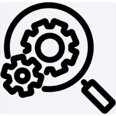

<div align="center">
  

  # 🔍 Hệ Thống Tra Cứu Hình Ảnh Google Drive

  *Ứng dụng Web (PWA) giúp tìm kiếm và tra cứu hình ảnh lưu trữ trên Google Drive thông qua mã sản phẩm hoặc quét mã QR/Barcode trực tiếp bằng Camera.*
</div>

---

## 📝 Giới thiệu
Đây là một ứng dụng Web tĩnh (Static Web App) hoạt động như một công cụ tra cứu nội bộ. Ứng dụng lấy dữ liệu trực tiếp từ Google Drive (thông qua Google Apps Script API) và cho phép người dùng tìm kiếm hình ảnh một cách nhanh chóng. 

Đặc biệt, ứng dụng đã được tích hợp công nghệ **PWA (Progressive Web App)**, cho phép cài đặt trực tiếp lên màn hình chính của điện thoại hoặc máy tính giống như một ứng dụng Native thông thường (không cần qua App Store/CH Play).

## ✨ Tính năng nổi bật
- 🔄 **Đồng bộ tự động:** Tự động lấy dữ liệu hình ảnh (URL và Tên) từ Google Drive mỗi khi mở ứng dụng.
- ⌨️ **Tìm kiếm thông minh:** Tìm kiếm nhanh hình ảnh bằng cách nhập mã hoặc từ khóa.
- 📷 **Quét mã QR / Barcode:** Tích hợp tính năng mở Camera quét mã. (Tự động trích xuất chuỗi ký tự trước dấu `;` để làm từ khóa tìm kiếm).
- 📱 **Cài đặt như App (PWA):** Có thể "Thêm vào màn hình chính" (Add to Home Screen) trên cả iOS, Android và Desktop.
- ⚡ **Giao diện tối ưu:** Thiết kế trực quan, hiển thị dạng lưới (Gallery), thân thiện với mọi kích thước màn hình (Responsive).

## 🛠 Công nghệ sử dụng
- **Frontend:** HTML5, CSS3, JavaScript (Vanilla).
- **Thư viện bên thứ 3:** [html5-qrcode](https://github.com/mebjas/html5-qrcode) (Hỗ trợ quét mã qua Camera).
- **Backend/Database:** Google Apps Script (Xử lý API) & Google Drive (Lưu trữ ảnh).
- **PWA:** Manifest.json & Service Worker (sw.js).

## 🚀 Hướng dẫn cài đặt & Sử dụng

### 1. Đối với người dùng cuối
Vì ứng dụng đã được đẩy lên GitHub, bạn không cần cài đặt phức tạp. 
1. Truy cập vào đường dẫn trang web (GitHub Pages) của dự án.
2. Trình duyệt sẽ hiển thị gợi ý **"Cài đặt ứng dụng"** (hoặc chọn "Thêm vào màn hình chính" trong menu chia sẻ).
3. Sau khi cài đặt, bạn có thể mở ứng dụng từ màn hình chính và sử dụng bình thường.

### 2. Đối với nhà phát triển (Clone code)
Nếu bạn muốn tải mã nguồn về để chỉnh sửa:
```bash
# Clone dự án về máy
git clone [https://github.com/Packingtnems/COMPONENT.git](https://github.com/Packingtnems/COMPONENT.git)

# Mở thư mục dự án
cd COMPONENT
